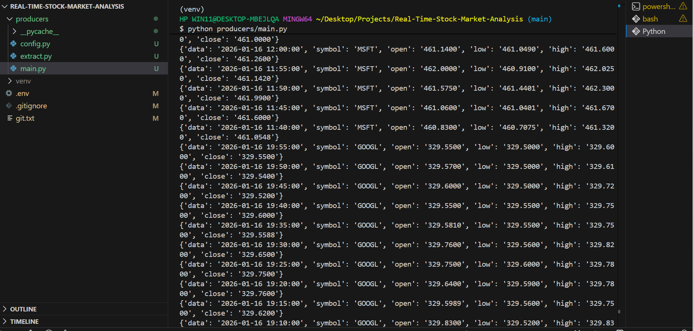
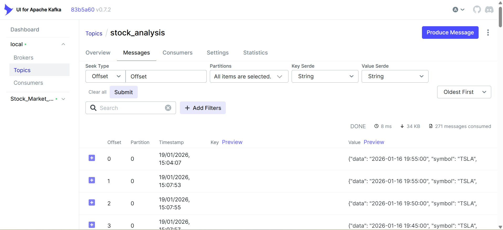
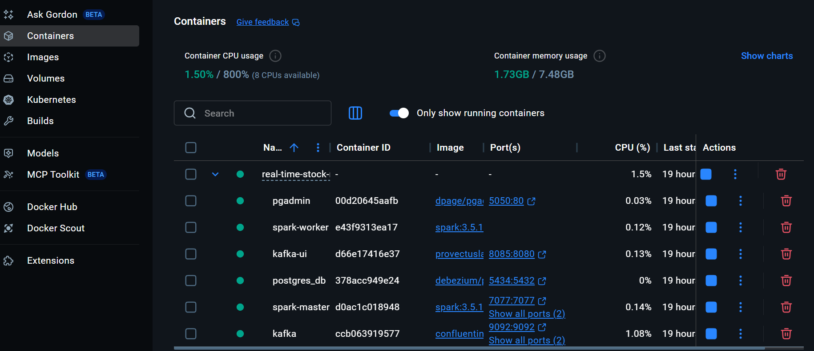
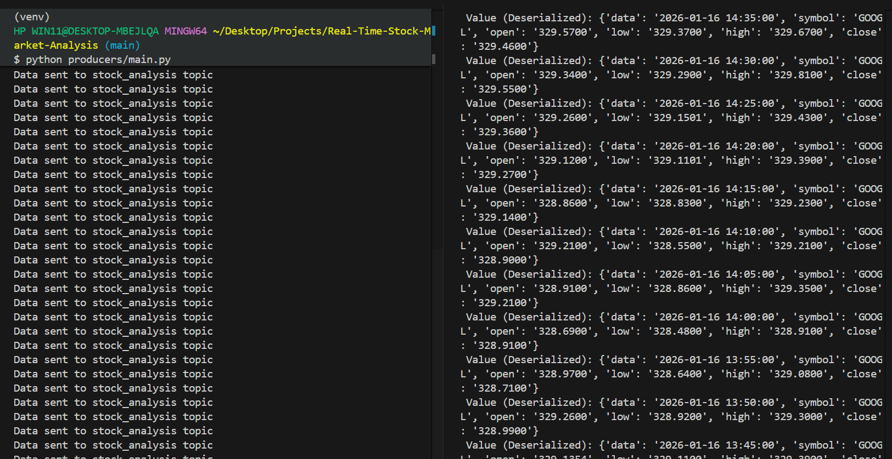

# Real Time Stock Market Analysis Project


## Background Story
MarketPulse Analytics is a New York–based financial analytics firm serving institutional investors with real-time market insights. As client demand and data volumes grow, the need for faster, more reliable analytics has become critical to maintaining competitiveness.

The Real-Time Stock Market Analysis project aims to build a scalable real-time data pipeline that delivers low-latency insights and interactive dashboards. This solution will improve operational efficiency, enhance client decision-making, and strengthen MarketPulse’s position in the fast-paced financial market.


## Overview

This project implements a Real-Time Stock Market Analysis Data Pipeline using modern data engineering tools. It ingests real-time stock data, streams it through Kafka, processes it with Spark, stores it in PostgreSQL, and provides monitoring and visualization through Kafka UI and pgAdmin. All components are containerized with Docker for easy deployment.

## Project Setup Guide

This guide walks you through setting up the project environment, installing dependencies, and running the application locally using Docker and Python.

## Technologies Used

* **Git** – to create and initialize the repository locally
* **Python** – Data producer & consumer logic
* **Apache Kafka** – Real-time message streaming
* **Kafka UI** – Kafka topic & consumer monitoring
* **API** - Produces JSON events into Kafka.
* **Apache Spark** – Stream processing
* **PostgreSQL** – Data storage
* **pgAdmin** – Database management UI
* **Docker & Docker Compose** – Containerization & orchestration
* **WSL 2** – Linux environment on Windows
* **Power BI** - External (connects to Postgres database).

---

## Data Pipeline Architecture


---

## Prerequisites

Verify installations using:

```bash
git --version
python --version
docker --version
docker compose version
```

Create a Python virtual environment to isolate dependencies:

```bash
python -m venv venv
```

Activate the environment:

```bash
source venv/Scripts/activate
```
---
## Environment Setup and Version Control

### Git Initialization (Local Version Control)

Instead of cloning an existing repository, this project was created locally and version control was initialized using Git.

Steps performed:

```bash
git init
git add .
git commit -m "Initial commit"
```

This initializes a local Git repository to track code changes throughout development.

### GitHub Remote Repository

After initializing Git locally, a remote GitHub repository was created and linked to the project for backup and collaboration.

```bash
git remote add origin <repository-url>
git push -u origin main
```

---

## API Setup and Data Fetching

As part of the initial environment setup, an **external stock market API** was integrated to retrieve real-time stock data.

### API Key Management

* An API key was generated from a third-party stock market API provider.
* The key was stored securely using a `.env` file.
* The `python-dotenv` package was used to load environment variables.

```python
from dotenv import load_dotenv
import os

load_dotenv()
API_KEY = os.getenv("API_KEY")
```

This approach ensures sensitive credentials are not hardcoded into the source code.

---

### Fetching Data from the API

Python was used to send HTTP requests to the external API and retrieve stock market data.

Key points:

* The **HTTP GET method** is used to request data from the API.
* API responses are received in **JSON format**.
* The fetched data is parsed and prepared for streaming into Kafka.

This step verifies:

* Successful API connectivity
* Proper handling of API responses
* Readiness of data for downstream processing

---

## Code Modularization

To improve maintainability and reusability, the codebase was modularized by separating responsibilities into different files and functions.

Examples include:

* API data fetching logic
* Kafka producer logic
* Kafka consumer logic
* Utility and configuration modules

Functions are imported across modules to allow seamless communication between components.

---

## Docker and Containerization Setup

### Docker Purpose

Docker is used to containerize the application and its dependencies, ensuring consistent behavior across different environments.

### Docker Compose

A `docker-compose.yml` file is used to manage multiple services, including:

### Docker Services

| Service      | Description                |
| ------------ | -------------------------- |
| Kafka        | Message broker             |
| Kafka UI     | Kafka monitoring dashboard |
| Spark Master | Spark cluster controller   |
| Spark Worker | Executes Spark jobs        |
| PostgreSQL   | Data storage               |
| pgAdmin      | Database UI                |

### Access Services

| Service  | URL                                            |
| -------- | ---------------------------------------------- |
| Kafka UI | [http://localhost:8085](http://localhost:8085) |
| Spark UI | [http://localhost:8081](http://localhost:8081) |
| pgAdmin  | [http://localhost:5050](http://localhost:5050) |


Docker Compose allows all services to be started with a single command:

```bash
docker compose up -d
```

Verify containers are running:

```bash
docker compose ps
```

---

## Running the Application

1. Start Docker services:

```bash
docker compose up -d
```


2. Create Kafka Topic (If Not Auto-Created)

Kafka topic is created automatically but If it does not exist, create it manually:

```bash
docker exec -it kafka kafka-topics --create \
  --topic stock_analysis \
  --bootstrap-server localhost:9092 \
  --replication-factor 1 \
  --partitions 1
```

---

3. Run the Kafka Producer

Start the producer to fetch real-time stock data and send it to Kafka:

```bash
python producers/main.py
```

---

4. Run the Kafka Consumer

In a new terminal, start the consumer to read messages from Kafka, or split the terminal to view both producer and consumer:

```bash
python consumer.py
```

You should see real-time stock data printed to the terminal.

---

5. Stop the Services

To stop all running containers:

```bash
docker compose down
```
---

## Additional Notes

* Environment variables are managed securely using `.env`
* Docker ensures platform-independent execution
* Kafka enables real-time streaming of stock market data
* Modular design improves code readability and scalability
* Ensure Docker Desktop is running before executing Docker commands.
* If containers don’t appear in Docker Desktop, confirm your Docker context is set to `desktop-linux`.
* Always activate your virtual environment before running Python scripts.

---

## Common Issues & Fixes


### Containers Not Showing in Docker Desktop

* Ensure **WSL 2 integration** is enabled
* Use correct Docker context:

```bash
docker context use desktop-linux
```

* Restart Docker Desktop

---

## Deliverables

* **API data successfully fetched using Python**  

* **Real-time stock data published to Kafka topics**  

* **Kafka services running in Docker containers** 

* **Kafka UI accessible via browser**

* **A Docker Compose configuration that builds and runs the application consistently**

* **Consumer prints deserialized stock data** 

* **Spark processes streaming data** 

* **PostgreSQL stores processed results** 

---

## Learning Outcomes

* Real-time data streaming with Kafka
* Modular Python application design
* Docker-based microservices architecture
* Spark streaming fundamentals
* End-to-end data pipeline implementation

---