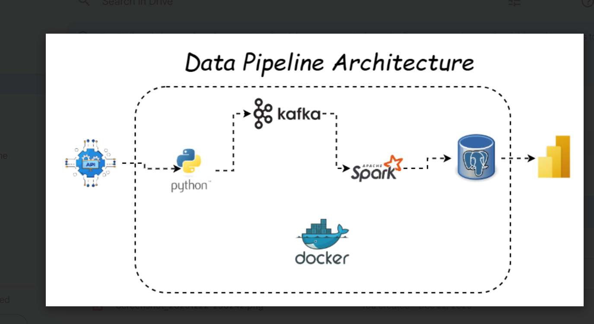

## Project Name: Real Time Stock Market Analysis

 The Project implements a real-time data pipeline that extracts stock data from vantage API, streams it through Apache Kafka, processes it with Apache Spark, and loads it into a postgres database.

 **All components are containerized with Docker for easy deployment.**

### Data Pipeline Architecture

## Project Tech Stack and Flow
- `Kafka UI - Inspect topics/messages.`
- `API - Produces JSON events into Kafka.`
- `Spark - Consumes from Kafka, writes to Postgres.`
- `Postgres - Stores results for analytics.`
- `pgAdmin - Manage Postgres visually.`
- `Power BI - External (connects to Postgres database).`